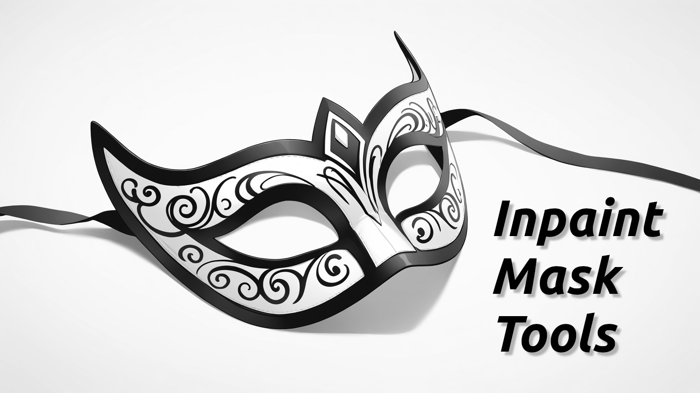

## Introduction
Inpaint Mask Tools is an extension for A1111 (compatible with reForge) designed to enhance the inpainting experience, making it significantly more user-friendly. Whether you are a beginner or an experienced effortgenner, this extension will provide valuable assistance.

The default settings help prevent some of the most common mistakes made by A1111 users.

## How it works and why you need this extension
It's important to understand how A1111 handles inpainting in "Only masked" mode under the hood. To keep things simple, we won’t dive too deep into the technical details but will instead focus on the general principles. The color images in this section are compressed as lossy JPEGs to reduce repository size.

All images are generated from some sort of noise (hence the term "denoising"). The only difference between txt2img and img2img is the source of the noise the AI model receives as input. In pure txt2img mode the backend generates a canvas full of noise then performs N *inference steps* (where N is usually 15 to 40) to derive the desired image from this noise guided by the prompt. The "X/Y/Z plot" script helps visualize this process:

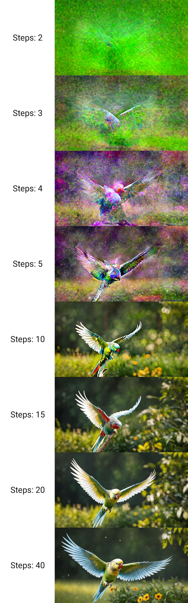

In img2img or inpainting mode, instead of receiving a fully noisy canvas, the AI model takes only the **user-selected (masked) area, which is then resized to the specified dimensions**.

Let’s consider a scenario where we want to generate a detailed, high-quality image of a parakeet. We start with a 1536×864 base image (rawgen), then upscale it 2× using the Remacri upscaler in the Extras tab, resulting in a 3072×1728 image. Now, let’s take a closer look. While the upscaler has enhanced the image slightly, the result isn’t significantly better than what we’d get from a standard non-AI-based upscaler.
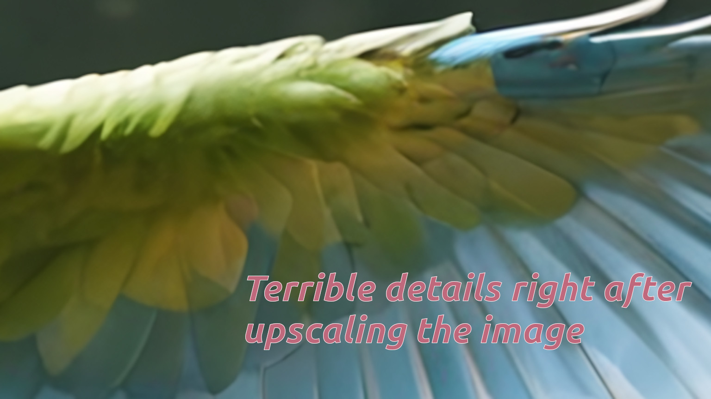

To improve the level of detail, let’s mask the area (along with some surrounding space to provide the AI with better context) and use inpainting. Here’s how it looks in WebUI:
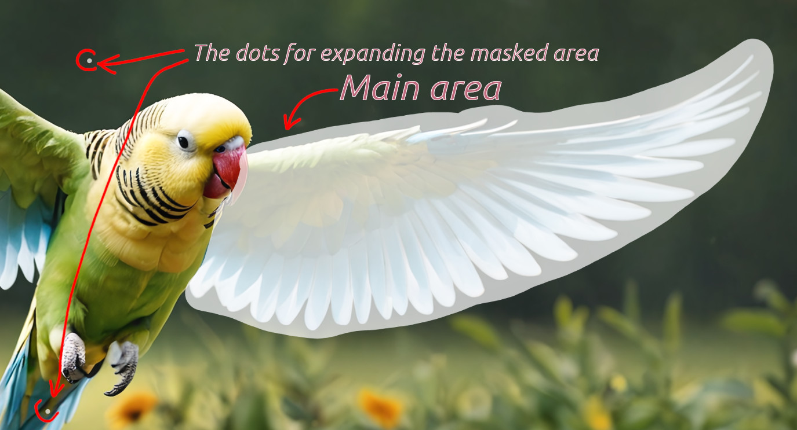

The following img2img parameters are set:
* Resize mode: Just resize
* Mask blur: 32 (default: 4)
* Inpaint area: Only masked (default: Whole picture)
* Only masked padding, pixels: 32
* Sampling method / Schedule type: Euler A / Automatic
* Denoising strength: 0.4
* Width / Height: **1024x1024**

Using these dimensions for inpainting is one of the most common mistakes A1111 users make. It’s easy to overlook, but it significantly impacts quality.  

[!NOTE]
It's some sort of common knowledge and also a misconception (usually found on websites like Civitai) that "_SDXL-based checkpoints are trained on 1024x1024 datasets, and any other dimension won't work well_". Whoever wrote that is probably still living in a cave, unaware of Bucketing (which allows multiple aspect ratios in a dataset) and the fact that modern models can generate much larger images without issue.

[!TIP]
Extensive experimenting by the author of this repository has shown that most modern models rely more on target *resolution* rather than specific *dimensions*. Nowadays, NoobAI-based checkpoints can easily generate rawgens between 1 Mp (e.g., 1024×1024) and 2 Mp (e.g., 1600×1200). While most PDXLv6 checkpoints perform best at basegens below 1.5 Mp, some models - such as Rainpony Rainfall v2 - can generate txt2img outputs approaching 1.8 Mp. Inpainting at low denoising strengths (<0.45, depending heavily on the sampler) allows for even higher resolutions, typically up to 2–2.2 Mp. However, it is true that models struggle to produce quality outputs below the resolutions they were trained on.

Now, let’s see what results our chosen values will yield - citing the A1111 source code along the way!  

The masked area is [converted to the black and white](https://github.com/AUTOMATIC1111/stable-diffusion-webui/blob/82a973c04367123ae98bd9abdf80d9eda9b910e2/modules/processing.py#L1615):
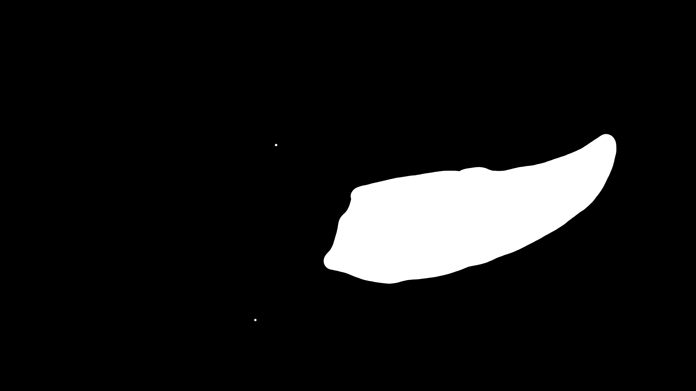

Next, a [Gaussian Blur is applied along both axes](https://github.com/AUTOMATIC1111/stable-diffusion-webui/blob/82a973c04367123ae98bd9abdf80d9eda9b910e2/modules/processing.py#L1630) of the mask:

[!WARNING]
Notice how the "expansion dots" are **almost washed out**. This means that if the Mask Blur value is set too high, your area expansion marks will disappear, rendering them ineffective. For the smallest brush size in A1111 WebUI, a Mask Blur value of 16 appears to be the upper limit.

Then, the conditional branch is executed because we are using the "Only masked" mode. The crop region is calculated, which is essentially _[a bounding box around the blurred mask with added padding](https://github.com/AUTOMATIC1111/stable-diffusion-webui/blob/82a973c04367123ae98bd9abdf80d9eda9b910e2/modules/masking.py#L6)_ (32 pixels on each side in our case).

Adding a simple debug print line reveals the crop area for our mask: `crop_region=(1030, 487, 2828, 1511)`. 

We can illustrate this area using ImageMagick: `convert "06 - blurred mask.png" -stroke red -strokewidth 2 -fill none -draw "rectangle 1030,487 2828,1511" "07 - bbox.png"`
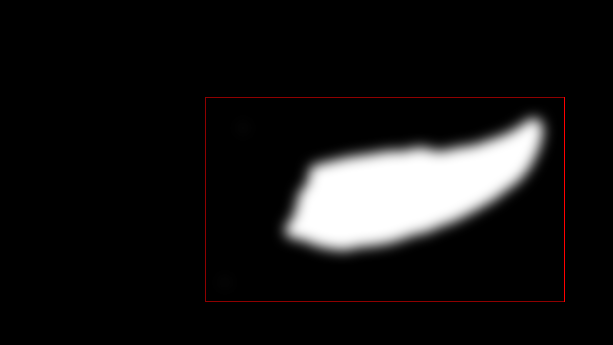

The bounding box is then [adjusted to match the aspect ratio](https://github.com/AUTOMATIC1111/stable-diffusion-webui/blob/82a973c04367123ae98bd9abdf80d9eda9b910e2/modules/masking.py#L39) of the dimensions set in the Width and Height fields (**1024x1024** in this case), resulting in `expand_crop_region=(1030, 0, 2828, 1728)`:
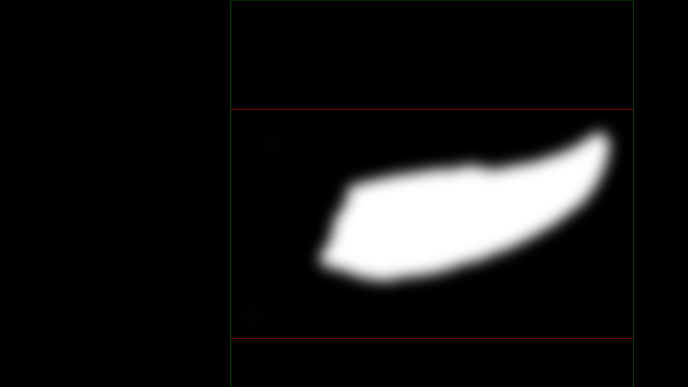

As you can see, this area is quite large.

Next, the mask is [resized to the user-specified dimensions](https://github.com/AUTOMATIC1111/stable-diffusion-webui/blob/82a973c04367123ae98bd9abdf80d9eda9b910e2/modules/processing.py#L1644) (1024x1024 in this case), borrowing some pixels to maintain the aspect ratio:


The backend then saves the coordinates where the final image should be injected, applies color corrections, and performs a few other minor adjustments that are not relevant for us here.

[Similar processing is applied to the image itself](https://github.com/AUTOMATIC1111/stable-diffusion-webui/blob/82a973c04367123ae98bd9abdf80d9eda9b910e2/modules/processing.py#L1693) (not just the mask), here's the resulting **1024x1024** image that will be fed into the AI model:
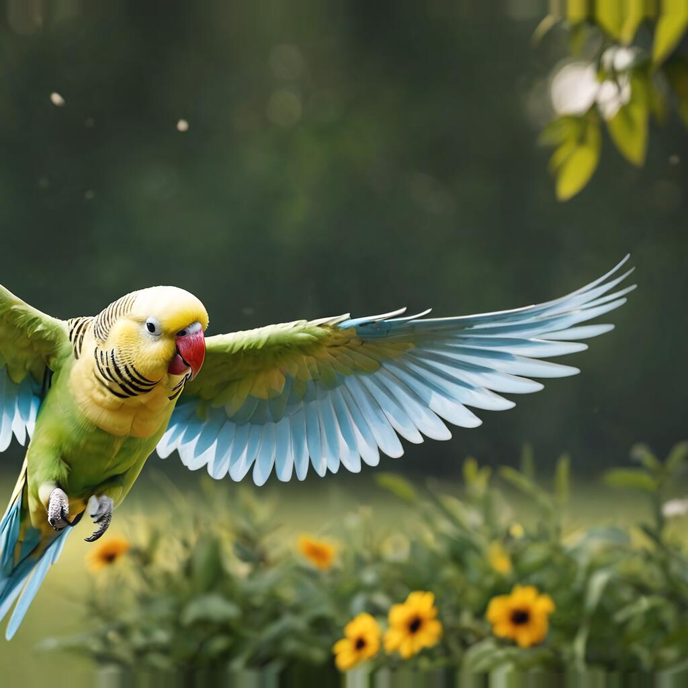

Let's zoom in on the generated result:
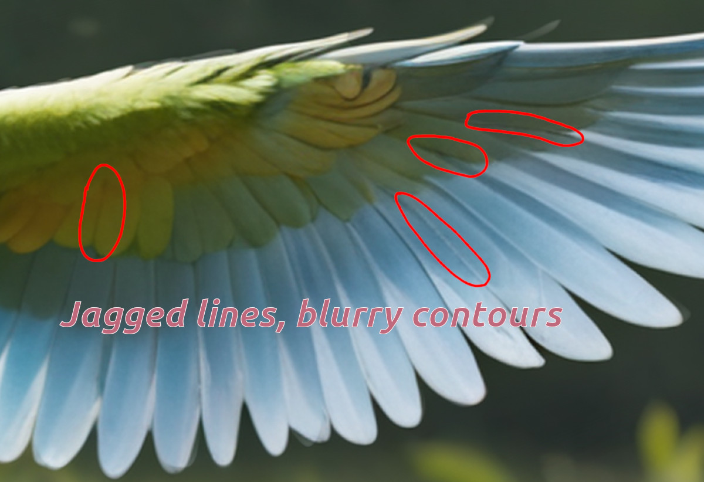

[!CAUTION]
The masked area in WebUI originally had dimensions of 1798x1024 - a whopping 1.8 Megapixels devoted solely to the parakeet’s wing and upper body. The model **can** denoise effectively at this resolution. However, due to how A1111 handles Width and Height, the input provided to the model is reduced to 1024x1024 (1 Mp), with an effective inpainting area of just 987x545 (0.54 Mp). Yes, you read that correctly: the backend has inserted a **987x545** image into a **1798x1024** region, resulting in a poorly resized, low-detail, crappy output. **As a result, we have lost 3.4 times the model's potential capabilities.**

Now, let's reuse the same seed and all other generation parameters - but this time, enable the extension, which will automatically measure and adjust the masked area dimensions. Here's the updated crop calculation:
```crop_region=(1030, 487, 2828, 1511)
expand_crop_region=(1029, 487, 2829, 1511), expanded size 1800x1024
```
AI model input dimensions: 1800x1024 (originally masked 1792x1024, automatically rounded to the nearest multiple of 8)
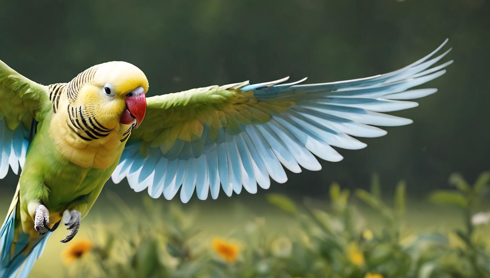
AI model output dimensions: 1800x1024, then downscaled back to 1792x1024 and injected into the original image according to the mask. Let's zoom in!
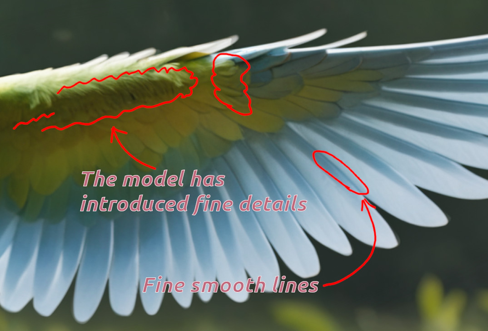

While this result shows a significant improvement over the previous image, there is still room for further enhancement. Passing such a large image to the model can dilute the **denoising strength**. There are two possible solutions - each effective in its own way but with specific trade-offs.  

| Solution                                                 | Pros                                                                                                                            | Cons                                                                                                                                                                                             |
|----------------------------------------------------------|---------------------------------------------------------------------------------------------------------------------------------|--------------------------------------------------------------------------------------------------------------------------------------------------------------------------------------------------|
| Increase the denoising strength                          | Doesn't require extra effort, making it a time-saving approach                                                                  | Higher denoising strength increases the risk of color inconsistencies and "malformed gens" (e.g., ghost limbs, double/triple body parts, and other unintended artifacts).                        |
| Run N subsequent inpaints at the same denoising strength | Allows gradual quality improvement and granular quality control if `Batch Size > 1`. Can be automated using the Loopback script | Repeated inpainting without adjusting the mask makes the edges more pronounced. If Soft Inpainting is enabled the inpaint seams will be even more visible, requiring some manual post-processing |


## Features
### Quick controls for mask dimensions
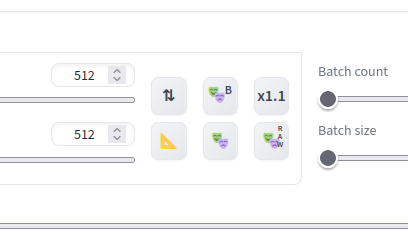

The extension adds four buttons to the Inpainting tab of the img2img section, providing tools to measure the masked area. This is especially useful for users working with high-resolution images (3K and above) who rely on the "Only masked" inpainting mode.

The quick controls allow for the calculation of different mask areas, with the most useful button factoring in both Blur and Padding settings. These controls are only available when the Inpaint tab is active and are disabled for all other img2img modes.

## Autoadjusting Width and Height in "Only masked" mode.
No more inpainting elongated areas at the default 1024×1024 resolution! This feature is an essential tool for high-quality inpainting. It is primarily intended for users working with low-resolution rawgens (typically under 2 megapixels) but can also be effectively leveraged by experienced users when paired with an appropriate upscaling factor (more on this below).

When enabled alongside the "Only Masked" mode, this option overrides any values set in the "Resize to" tab (even those applied by the quick controls). Instead, the extension automatically recalculates and applies the optimal width and height based on the dimensions of the masked area.

## Autoupscaling mask area if its resolution is too low
Most modern models, trained primarily on 1024px+ datasets, struggle to produce high-quality inpaints at lower resolutions while excelling at their native and slightly higher resolutions.

Inpainting a 600×248 area with a cutting-edge model will never yield the best results. To address this, enable Auto-Upscaling: if the masked area’s resolution is *lower* than the specified target, it will be upscaled to meet the defined threshold. Recommended values: 1–1.5 MP, though some models can handle 2–2.3 MP effectively.

If you do *segmented inpainting* of some huge canvas consider keeping this value at 0 (disabling Auto-Upscaling) and relying on Quick Controls instead. However, setting it to 1.8–2.5 MP while drawing slightly smaller masks can improve detail.

**This option is only active when Autoadjusting is enabled.**

### Whole Picture inpainting safeguard
Prevents wasted time on generating unintentionally shrunk images. This feature detects unusual dimensions in Whole Picture mode and immediately halts generation. A slight variation in resolution is permitted, as minor shrinking or expansion by a few pixels is often intentional.
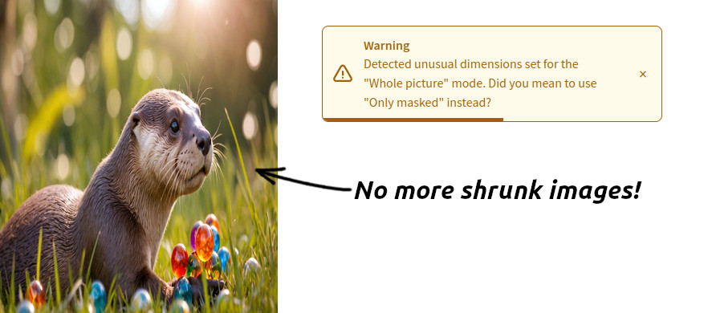

### Auto-rounding width and height to multiple of 8
This is a common mistake that can occur due to an accidental typo. If the width or height are not multiples of 8, the resulting image will have visual glitches on the edges of inpainted areas. Example:

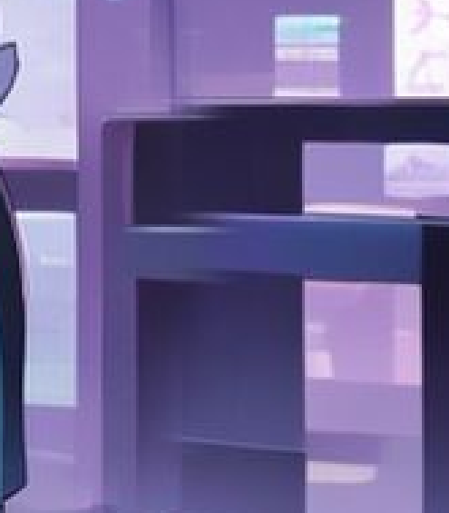

### Quicksettings List integration
Allows you to adjust the necessary options in a convenient way. Changes come into effect the next time the "Generate" button is clicked. Type `imt_` into the Quicksettings search bar to locate the 4 available options.

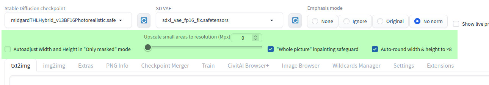

Caveat: if you are changing the Upscale factor by typing it into the field, **make sure to hit Enter to apply it**. Alternatively, you can use the slider, which automatically applies the changes.

## Development
I consider this extension feature-complete. If you are looking for additional functionality, feel free to make a Pull Request with your code!

This project is licensed under GPL v3, except for a small piece of code borrowed directly from the original A1111 repository, which is licensed under AGPL v3.

This project uses [ruff](https://github.com/astral-sh/ruff) and [biome](https://github.com/biomejs/biome) for enforcing the consistent code style for Python and Javascript, respectively.

Regarding compatibility with reForge: this front-end seems to ignore all notification pop-ups generated by Gradio. While this extension sends notifications, the messages are also duplicated in the log.

This extension has not been tested with plain Forge; however, it is believed to work just fine, except for the notifications.
