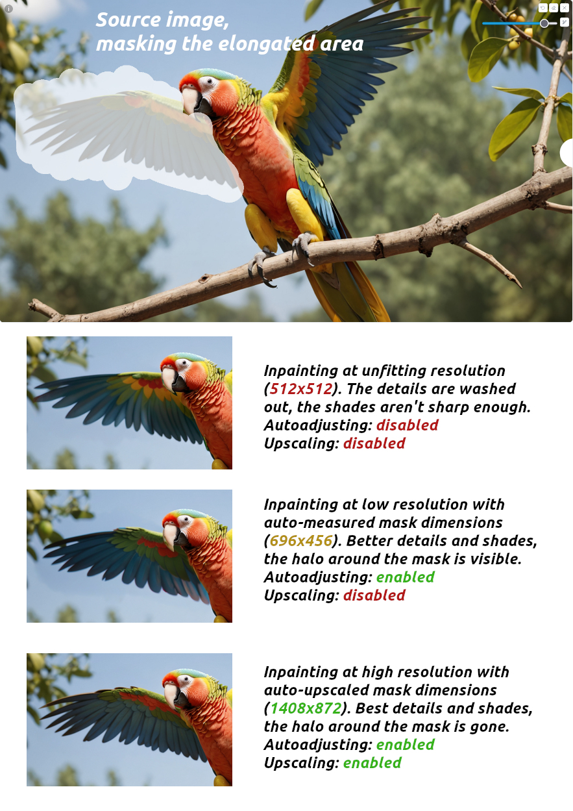

## Introduction
Inpaint Mask Tools is an extension for A1111 (compatible with reForge) designed to enhance the inpainting experience, making it significantly more user-friendly. Whether you are a beginner or an experienced effortgenner, this extension will provide valuable assistance.

The default settings help prevent some of the most common mistakes made by A1111 users.

## Features
### Quick controls for mask dimensions

The extension adds four buttons to the Inpainting tab of the img2img section, providing tools to measure the masked area. This is especially useful for users working with high-resolution images (3K and above) who rely on the "Only masked" inpainting mode.

The quick controls allow for the calculation of different mask areas, with the most useful button factoring in both Blur and Padding settings. These controls are only available when the Inpaint tab is active and are disabled for all other img2img modes.

## Autoadjusting Width and Height in "Only masked" mode.
No more inpainting elongated areas at the default 1024×1024 resolution! This feature is an essential tool for high-quality inpainting. It is primarily intended for users working with low-resolution rawgens (typically under 2 megapixels) but can also be effectively leveraged by experienced users when paired with an appropriate upscaling factor (more on this below).

When enabled alongside the "Only Masked" mode, this option overrides any values set in the "Resize to" tab (even those applied by the quick controls). Instead, the extension automatically recalculates and applies the optimal width and height based on the dimensions of the masked area.

## Autoupscaling mask area if its resolution is too low
Most modern models, trained primarily on 1024px+ datasets, struggle to produce high-quality inpaints at lower resolutions while excelling at their native and slightly higher resolutions.

Inpainting a 600×248 area with a cutting-edge model will never yield the best results. To address this, enable Auto-Upscaling: if the masked area’s resolution is *lower* than the specified target, it will be upscaled to meet the defined threshold. Recommended values: 1–1.5 MP, though some models can handle 2–2.3 MP effectively.

If you do *segmented inpainting* of some huge canvas consider keeping this value at 0 (disabling Auto-Upscaling) and relying on Quick Controls instead. However, setting it to 1.8–2.5 MP while drawing slightly smaller masks can improve detail.

**This option is only active when Autoadjusting is enabled.**

### Whole Picture inpainting safeguard
Prevents wasted time on generating unintentionally shrunk images. This feature detects unusual dimensions in Whole Picture mode and immediately halts generation. A slight variation in resolution is permitted, as minor shrinking or expansion by a few pixels is often intentional.

### Auto-rounding width and height to multiple of 8
This is a common mistake that can occur due to an accidental typo. If the width or height are not multiples of 8, the resulting image will have visual glitches on the edges of inpainted areas. Example:

### Quicksettings List intergration
Allows you to adjust the necessary options in a convenient way. Changes come into effect the next time the "Generate" button is clicked. Type `imt_` into the Quicksettings search bar to locate the 4 available options.

Caveat: if you are changing the Upscale factor by typing it into the field, **make sure to hit Enter to apply it**. Alternatively, you can use the slider, which automatically applies the changes.

## Development
I consider this extension feature-complete. If you are looking for additional functionality, feel free to make a Pull Request with your code!

This project is licensed under GPL v3, except for a small piece of code borrowed directly from the original A1111 repository, which is licensed under AGPL v3.

This project uses [ruff](https://github.com/astral-sh/ruff) and [biome](https://github.com/biomejs/biome) for enforcing the consistent code style for Python and Javascript, respectively.

Regarding compatibility with reForge: this front-end seems to ignore all notification pop-ups generated by Gradio. While this extension sends notifications, the messages are also duplicated in the log.

This extension has not been tested with plain Forge; however, it is believed to work just fine, except for the notifications.
